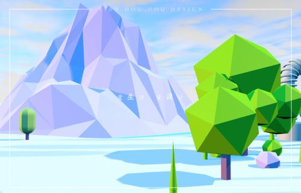
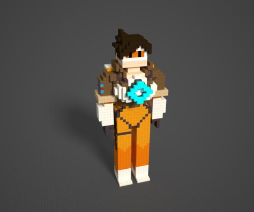

# 饥饿游戏

[TOC]

##  玩法
灵感来源 [饥饿游戏](https://movie.douban.com/subject/3592853/)

`玩家在指定时效内从一张圆形地图的边缘抵达地图中心点 （多人竞技 或 单人冲关）`
- 玩家实时逃生（几分钟左右一局）
- 死亡即失败 无重生
- 策咯性（随机元素多） 游戏时间限制的压迫感 ->竞速策咯生存

##元素
### AI巨人  
`（位置：地图中心逃生口）拥有作用全局的效果 技能`
  1. 道具（扔石头）
  2. 节能（摧毁一定范围全部道路）
  3. 环境控制（玩家阻力 弹跳力）

### 道路
`由砖块组成 (类似超级马里奥 顶的那种砖块)`
- - 道路特点
   1.3D多层次立体
   2.漂浮在空中 玩家未行进在道路上则掉落深渊 Game Over
   3.部分道路在游戏进行时动态生成（随机性）
- - 砖块类型
   1.普通
   2.重力型 踩踏后掉落
   3.弹力型 弹跳力加强
   
### 玩家
  1.不同类型可以具有不同特点增加随机性（具体没想好）
  
### 场景道具
   1.随机功能（暂时没想好）
### 时间
`时间相关设置 都是给玩家压迫感 逼迫玩家在多样策略选择和时间压制下做最优选择`
  1.随时间流逝，变化场景状态（巨人发动->速度 弹力）

## 模式
- 单人模式 
`时间限制和场景元素造成的阻碍 `
- **多人模式** 
` 玩家之间竞争 由场景道具提供玩家之间相互影响`
- **多人组队模式**
 `队伍中任何一人抵达判定胜利 队伍可以分配主突击手 和辅助位置 提供增益或者骚扰对手`
- BOOS模式
 `随机一名玩家成为BOSS（特殊能力 特殊加强） 其他玩家在时限内阻止BOSS逃生 `
  

## 大概描述
### 游戏性
 - `策略性` 由游戏相关元素组成的各种随机性给玩家提供
 - `竞技性` 由时限相关设置给玩家造成压迫感 
### 美术
 - 简单 清爽  
  - [ ] 低多边形风格
  
  - [ ] Magicavoexl 体素模型
  
 - 风格（建议卡通风格）
### 技术
 - 通信 帧同步
 - 前端 尽量将游戏元素模块化方便关卡设计，降低维护成本
  `大量物理检测（collider）的性能瓶颈`

  **初稿 2018.5.6 01点31分**
